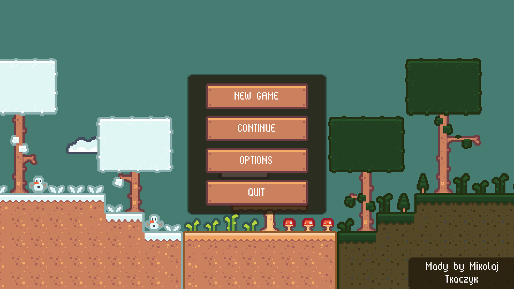
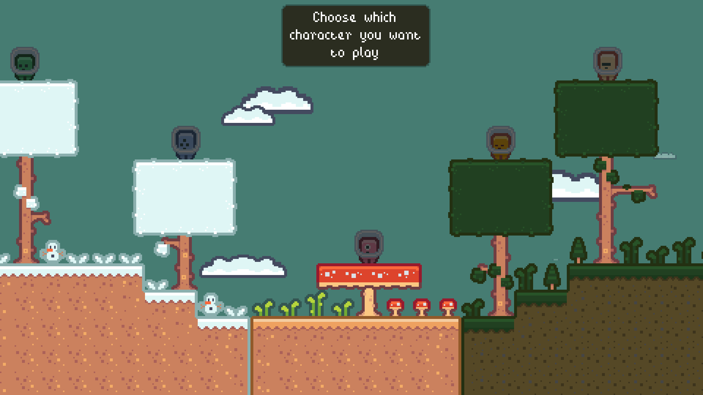

# Introduction
This is a 2D Platformer game named "xxx".  
To create a game I used the built-in language "GDScript", which is used in "Godot Engine".  

## About Game
When u open the game, your eyes will see a beautiful menu, where u have 4 options:  
- New Game
- Continue
- Options
- Quit  
  

***

After when u press "NEW GAME", u have a choice to pick one of five characters which one u want to play.  
Depending on which character color you choose, this is the skill color your character will have.
  
