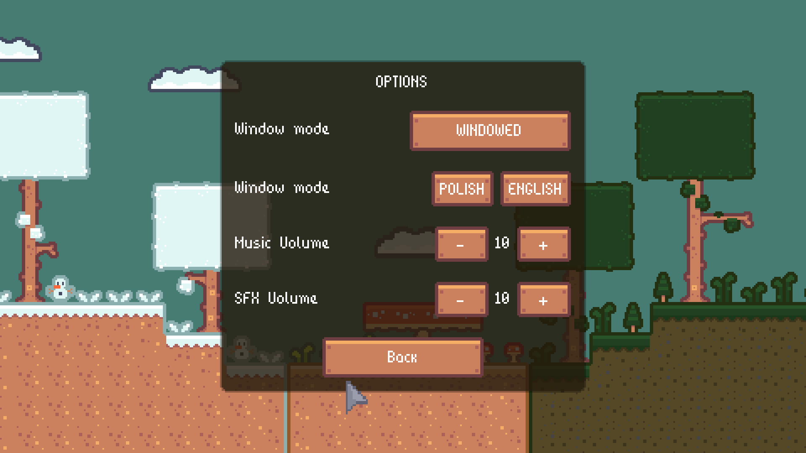
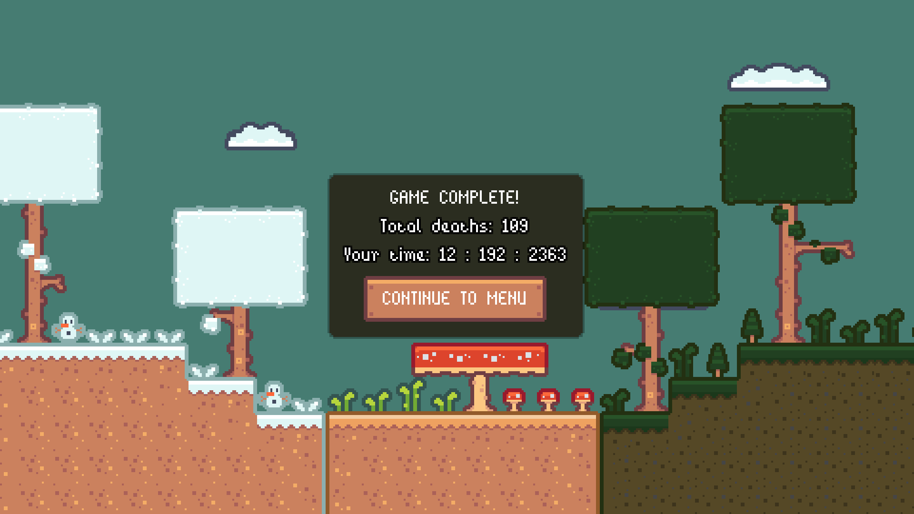

# Introduction
This is a 2D Platformer game named <b>"xxx"</b>.  
To create a game I used the built-in language "GDScript", which is used in "Godot Engine".  
It's a simple platformer, where u need to collect coins and kill different enemies.   

### About Game
When u open the game, your eyes will see a beautiful menu, where u have 4 options:   

***

- <b>New Game</b>  
After when u press "NEW GAME", u have a choice to pick one of five characters which one u want to play.  
Depending on which character color you choose, this is the skill color your character will have.
  

- <b>Continue</b>    
If you press "CONTINUE" your game will load at the last checkpoint.  

- <b>Options</b>   
On the options menu, you can change the volume of music, SFX, window resolution and language.  
  

- <b>Quit</b>   
After press "QUIT" your game will end.  

### Skills
<ul>
    <li>Level 1
        <ul>
            <li>In this level you can kill an enemy after you jump on his head.</li>
        </ul>
    </li>
    <li>Level 2 - 4
        <ul>
            <li>In this three levels u have dash on key "SHIFT", and when u "dash" to enemy u will kill then.</li>
        </ul>
    </li>
    <li>Level 5-7
        <ul>
            <li>And in the last 3 levels, when you press the "Attack" button at the bottom right of the screen, you will kill your opponent.</li>
        </ul>
    </li> 
</ul>  

## Levels
Also, in the upper left corner next to the coin counter, you have a time counter and a death counter,  
both of these things will be counted at the end of the game.  
You need to complete 7 different levels to pass the game  for example:     

